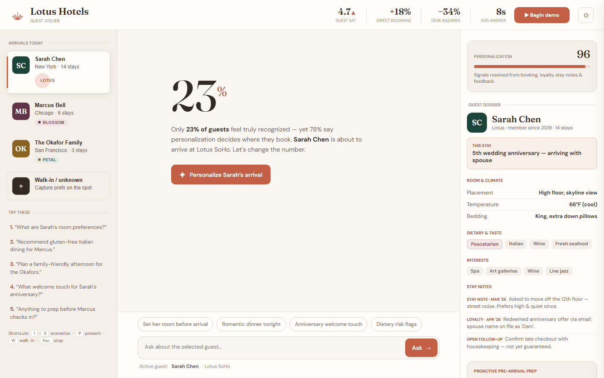
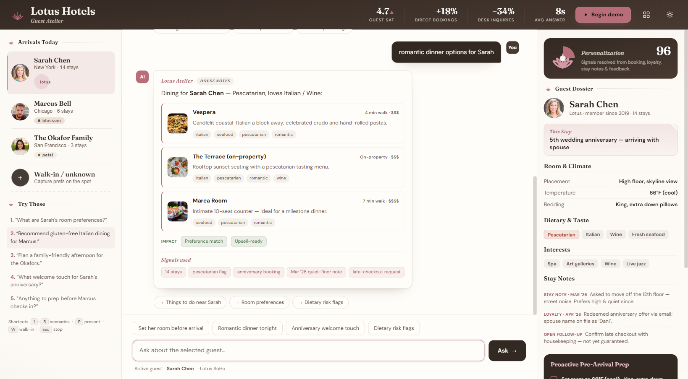
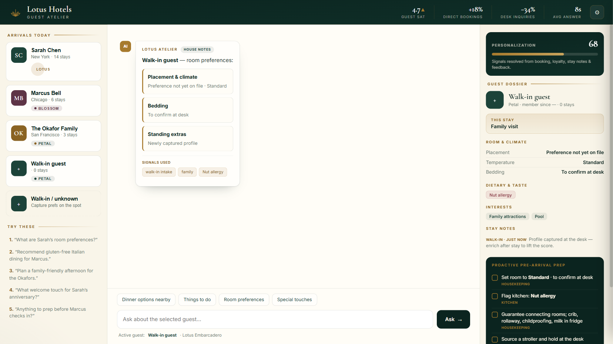
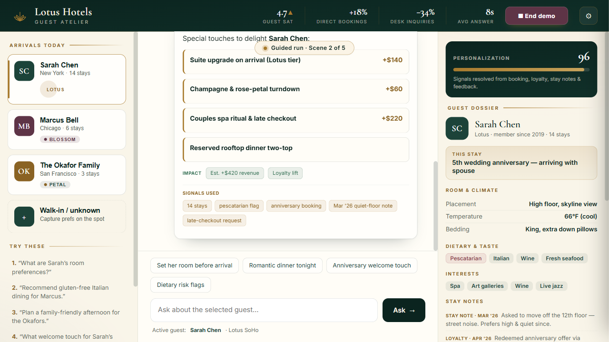

# Lotus Hotels · Guest Atelier

An AI-powered **Guest Personalization Assistant** for a boutique hotel chain — built as a hackathon proof-of-concept. It turns fragmented guest data (bookings, loyalty, past-stay notes, feedback) into instant, **explainable** recommendations that staff can act on at pre-arrival and check-in.

> **The gap it closes:** only **23%** of guests feel truly recognized, yet **78%** say personalization decides where they book. Guest Atelier is the bridge.



---

## Highlights

- **Single self-contained `index.html`** — no build step, no dependencies, no server. Double-click and it runs, fully offline.
- **Natural-language concierge** — staff ask in plain English; the on-device engine resolves intent and returns tailored recommendations.
- **Explainable by design** — every answer shows the **"Signals used"** (the exact profile cues behind it) plus a business **Impact** callout.
- **Dietary safety guardrails** — celiac/nut-allergy guests can *never* be shown an unsafe venue (hard filter + visible "Risk-Siren").
- **Optional live LLM** — connect OpenAI or Azure OpenAI; if anything fails, it silently falls back to the on-device engine so a demo never breaks.
- **One-click guided demo** — presenter-ready "Begin demo" mode with scene labels, pause/step/restart, and keyboard shortcuts.

---

## What it does

| Capability | Description |
|---|---|
| **Guest dossiers** | 3 rich fictional profiles (anniversary couple, celiac business traveler, nut-allergy family) with tier, stay history, room prefs, dietary flags, interests, and source-tagged stay notes. |
| **Conversational queries** | "What are Sarah's room preferences?" · "Recommend gluten-free Italian for Marcus." · "Plan a family afternoon for the Okafors." |
| **Personalized recommendations** | Room & climate, dining, local activities, and special touches — ranked against the guest's profile and constraints. |
| **Proactive pre-arrival prep** | An owner-tagged checklist (Housekeeping / Kitchen / Concierge / Front Desk) generated per guest, with one-tap staff actions. |
| **Personalization score ("Bloom")** | Animated 23% → personalized score dramatizes the transformation for each guest. |
| **Walk-in intake** | Capture an unknown guest's prefs at the desk and personalize on the spot. |

### The five demo scenarios
1. What are Sarah's room preferences?
2. Recommend gluten-free Italian dining for Marcus.
3. Plan a family-friendly afternoon for the Okafors.
4. What welcome touch for Sarah's anniversary?
5. Anything to prep before Marcus checks in?



---

## Running it

**Simplest:** double-click `index.html` — it opens in your browser and works offline.

**Recommended for a live demo (serve over localhost):**
```bash
# from the project folder
python -m http.server 8777
# then open http://localhost:8777/index.html
```

### Presenter controls (Guided Demo)
Click **▶ Begin demo** (or press **P**) to auto-run the scripted scenarios.

| Key | Action |
|---|---|
| `1`–`5` | Jump to a scenario |
| `P` | Start / stop the guided demo |
| `W` | Walk-in intake |
| `Space` | Pause / resume the demo |
| `→` | Skip to the next scene |
| `R` | Restart the demo |
| `Esc` | Stop demo / close settings |

### Optional: connect a live model
Open the gear (⚙) → pick OpenAI or Azure OpenAI → paste a key.
Keys are held **for the browser session only** (never written to disk) and sent solely to the provider you select; Azure endpoints are validated to `*.openai.azure.com`. Any failure falls back to the on-device engine.



---

## How it was built — the agent network

This app wasn't written in one pass. It was produced by a **multi-agent "build network"** — an orchestrated crew of specialized AI agents, each with one job, coordinated by a Director that reconciles their output and iterates until it passes a real QA gate.

| Agent | Role | What it contributed here |
|---|---|---|
| **Director** | Orchestration & oversight | Ran the pipeline, arbitrated conflicts, kept scope tied to the brief |
| **Architect** | Prompt/spec engineer | Turned the brief into checkable acceptance criteria |
| **Maker** | Builder | Wrote the actual HTML/CSS/JS |
| **Critic** | Anti-"AI-slop" | Drove the original editorial direction, custom lotus, provenance lines, and invented venue names |
| **Wildcard** | Creative | Hero "23% → personalized" reveal, Bloom score, allergy Risk-Siren |
| **Verifier** | QA (owns the gate) | **Executed the app in a headless browser**; caught real bugs and a demo race condition |
| **User Advocate** | Real-need check | Owner-tagged checklist, quick actions, impact callouts, projector-safe layout |
| **Guardian** | Security · privacy · a11y | Caught a **DOM-XSS**, hardened API-key handling, validated the Azure endpoint, added keyboard/ARIA accessibility |

### Bugs the network caught & fixed
- **DOM-XSS** — free-text queries were injected via `innerHTML`; now escaped.
- **Demo race condition** — stop-then-restart could overlap runs; fixed with a per-run token.
- **API-key persistence** — moved from `localStorage` to session-only + a "Clear key" control.
- **Unvalidated Azure endpoint** — now restricted to `https://*.openai.azure.com`.
- **Intent-routing bugs** — a stopword ("the") mis-routed guests; welcome-touch vs. prep priority; missing family/afternoon intents. All fixed and re-verified.
- **Accessibility** — clickable `div`s became real buttons/checkboxes; ARIA labels, dialog semantics, contrast, and `prefers-reduced-motion`.



---

## Tech & scope

- **Stack:** vanilla HTML + CSS + JavaScript. Zero frameworks, zero build. One file.
- **UX system:** adapted from [ATV Design](https://github.com/All-The-Vibes/ATV-Design) using its warm editorial tokens, Fraunces/DM Sans typography, compact controls, layered surfaces, and responsive layout patterns.
- **Data:** in-memory fictional profiles (no database, no persistence, no PII).
- **AI:** an on-device rule/intent engine by default; optional OpenAI / Azure OpenAI passthrough.
- **Out of scope (per the hackathon brief):** real PMS/booking integration, auth/RBAC, cloud deployment, mobile app.

### Success metrics it targets
Higher guest satisfaction · more direct bookings & repeat visits · reduced front-desk inquiry volume · staff empowered with instant, trustworthy insights.

---

## Project structure
```
.
├── index.html                 # the entire application
├── README.md
├── LICENSE
└── docs/                       # screenshots for this README
    ├── screenshot-hero.png
    ├── screenshot-guided-run.png
    ├── screenshot-guardrail.png
    ├── screenshot-family.png
    └── screenshot-walkin.png
```

---

*Built as a hackathon proof-of-concept. Guest data is entirely fictional.*
