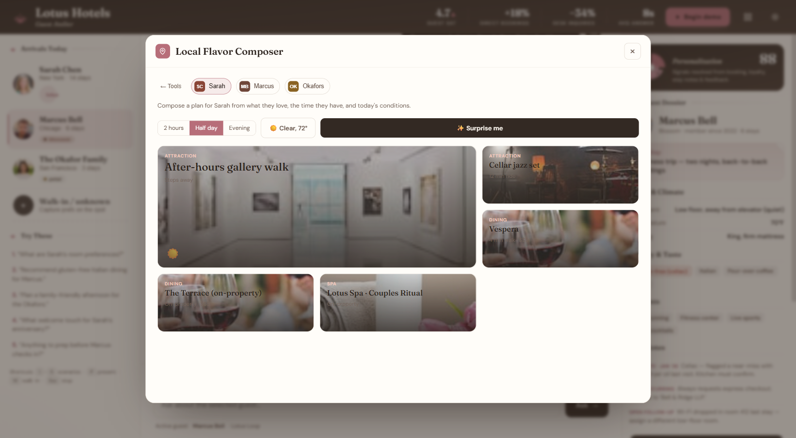
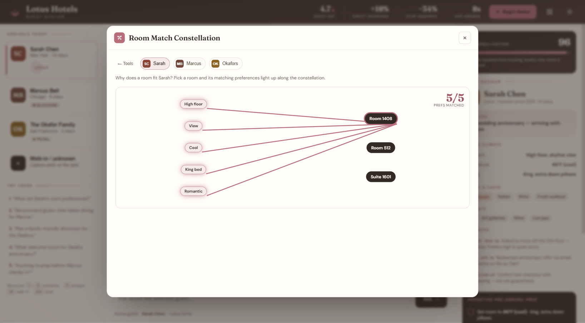
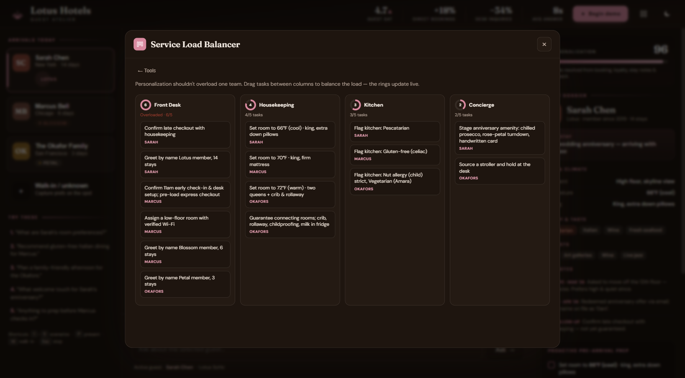

# Lotus Hotels · Guest Atelier

An AI-powered **Guest Personalization Assistant** for a boutique hotel chain — built as a hackathon proof-of-concept. It turns fragmented guest data (bookings, loyalty, past-stay notes, feedback) into instant, **explainable** recommendations that staff can act on at pre-arrival and check-in.

> **The gap it closes:** only **23%** of guests feel truly recognized, yet **78%** say personalization decides where they book. Guest Atelier is the bridge.


---

## Highlights

- **Single self-contained `index.html`** — no build step, no dependencies, no server. Double-click and it runs, fully offline.
- **100% on-device** — the reasoning engine runs entirely in the browser. **No API keys, no network calls, no data ever leaves the machine.**
- **Natural-language concierge** — staff ask in plain English; the engine resolves intent and returns tailored recommendations, with **contextual follow-up suggestions** after every answer.
- **Explainable by design** — every answer shows the **"Signals used"** (the exact profile cues behind it) plus a business **Impact** callout.
- **Dietary safety guardrails** — celiac/nut-allergy guests can *never* be shown an unsafe venue (hard filter + visible "Risk-Siren").
- **Real imagery** — guest portraits and photo thumbnails on every dining/activity recommendation (and photo-backed cards in the Local Flavor tool). Images load from the web with a graceful **fallback to inline SVG illustrations** if offline, so the demo never breaks.
- **"The Living Folio" art direction** — an editorial, ink‑and‑paper concierge identity: Fraunces ledger headings, a hand‑drawn hero, de‑boxed specimen rows, a signature **Lotus Dial** that inks in its petals as the personalization score rises, and a subtle paper grain. Deliberately not a generic SaaS dashboard.
- **Light & dark themes** — a warm rose-pink design system with a one-click theme toggle that respects your OS preference.
- **10 interactive "Atelier Tools"** — a launcher (press **T**) of visual, hands-on tools that turn guest data into action (storyboard, radar, dial, heatmap, constellation, and more).
- **One-click guided demo** — presenter-ready "Begin demo" mode with scene labels, pause/step/restart, and keyboard shortcuts.

---

## What it does

| Capability | Description |
|---|---|
| **Guest dossiers** | 3 rich fictional profiles (anniversary couple, celiac business traveler, nut-allergy family) with tier, stay history, room prefs, dietary flags, interests, and source-tagged stay notes. |
| **Conversational queries** | "What are Sarah's room preferences?" · "Recommend gluten-free Italian for Marcus." · "Plan a family afternoon for the Okafors." |
| **Personalized recommendations** | Room & climate, dining, local activities, and special touches — ranked against the guest's profile and constraints. |
| **Proactive pre-arrival prep** | An owner-tagged checklist (Housekeeping / Kitchen / Concierge / Front Desk) generated per guest, with one-tap staff actions. |
| **Personalization score ("Bloom")** | Animated 23% → personalized score dramatizes the transformation for each guest. |
| **Walk-in intake** | Capture an unknown guest's prefs at the desk and personalize on the spot. |

### The five demo scenarios
1. What are Sarah's room preferences?
2. Recommend gluten-free Italian dining for Marcus.
3. Plan a family-friendly afternoon for the Okafors.
4. What welcome touch for Sarah's anniversary?
5. Anything to prep before Marcus checks in?


---

## Atelier Tools

Press **T** (or the grid icon in the header) to open the **Atelier Tools** launcher — ten interactive, visual tools that turn the guest data into something staff can *act on*. Each is built from the same in-memory profiles, fully on-device.



| Tool | What it does |
|---|---|
| **Stay Storyboard** | The whole guest journey on one animated timeline (pre-arrival → checkout) with an "experience completeness" meter — drag cards to reschedule, tick them off as done. |
| **Lobby Radar** | A calm live-arrivals board that places each guest in a lane by how urgently they need attention; hover a blip for their one thing. |
| **Magic Handoff** | Folds a full dossier into a clean shift-change briefing the next team can read in seconds — with one-tap copy. |
| **Delight Budget Dial** | Spin a radial dial to a budget/time tier and get guest-specific surprise ideas instantly. |
| **Risk Heatmap** | Allergy, dietary, timing and service risk across every active guest, as a color-graded grid. |
| **Room Match Constellation** | Pick a room and watch the guest's preferences light up the traits they connect to, with a live match score. |
| **Guest Mood Mixer** | Set the mood with sliders and watch the greeting and recommended next actions adapt in real time. |
| **Recovery Playbook** | Drop an incident on a guest to generate a tailored acknowledge → fix → delight → log plan. |
| **Local Flavor Composer** | Composes a bento-style itinerary from interests, time available, and today's conditions — with a "surprise me" reshuffle. |
| **Service Load Balancer** | Balances prep tasks across the team on a kanban board — drag to reassign and watch the workload rings update live. |



---

## Running it

**Simplest:** double-click `index.html` — it opens in your browser and works offline.

**Recommended for a live demo (serve over localhost):**
```bash
# from the project folder
python -m http.server 8777
# then open http://localhost:8777/index.html
```

### Presenter controls (Guided Demo)
Click **▶ Begin demo** (or press **P**) to auto-run the scripted scenarios.

| Key | Action |
|---|---|
| `1`–`5` | Jump to a scenario |
| `P` | Start / stop the guided demo |
| `W` | Walk-in intake |
| `T` | Open the Atelier Tools launcher |
| `Space` | Pause / resume the demo |
| `→` | Skip to the next scene |
| `R` | Restart the demo |
| `Esc` | Stop the demo |

### Light & dark themes
Click the sun/moon toggle in the header (top-right) to switch themes. Your choice is remembered, and on first visit the app follows your operating-system light/dark preference. The palette is the warm **ATV design system** — terracotta accent, clay/cream neutrals, Fraunces + DM Sans type.



### Azure Container Apps deployment
The included `Dockerfile` serves the static app with Nginx on port `8080` and protects the site with HTTP Basic Auth. Configure these environment variables in the container app:

| Variable | Description |
|---|---|
| `BASIC_AUTH_USER` | Login username. Defaults to `guest` when omitted. |
| `BASIC_AUTH_PASSWORD` | Required password, stored as an Azure Container Apps secret. |

Deploy with Azure CLI from the project folder:

```powershell
.\scripts\deploy-azure-container-app.ps1 -Subscription "<subscription name or id>"
```

The script creates a project-scoped resource group, Azure Container Registry, Container Apps environment, and Container App, then prints the app URL plus generated Basic Auth credentials.

---

## How it was built — the agent network

This app wasn't written in one pass. It was produced by a **multi-agent "build network"** — an orchestrated crew of specialized AI agents, each with one job, coordinated by a Director that reconciles their output and iterates until it passes a real QA gate.

| Agent | Role | What it contributed here |
|---|---|---|
| **Director** | Orchestration & oversight | Ran the pipeline, arbitrated conflicts, kept scope tied to the brief |
| **Architect** | Prompt/spec engineer | Turned the brief into checkable acceptance criteria |
| **Maker** | Builder | Wrote the actual HTML/CSS/JS |
| **Critic** | Anti-"AI-slop" | Drove the original editorial direction, custom lotus, provenance lines, and invented venue names |
| **Wildcard** | Creative | Hero "23% → personalized" reveal, Bloom score, allergy Risk-Siren |
| **Verifier** | QA (owns the gate) | **Executed the app in a headless browser**; caught real bugs and a demo race condition |
| **User Advocate** | Real-need check | Owner-tagged checklist, quick actions, impact callouts, projector-safe layout |
| **Guardian** | Security · privacy · a11y | Caught a **DOM-XSS**, hardened data handling, and drove WCAG-AA contrast + keyboard/ARIA accessibility across both themes |

### How the network shaped it (across iterations)
- **DOM-XSS** — free-text queries were injected via `innerHTML`; now escaped.
- **Demo race condition** — stop-then-restart could overlap runs; fixed with a per-run token.
- **Removed the live-LLM / API-key feature entirely** — the app is now 100% on-device, which erased a whole class of key-handling and endpoint-validation risk and strengthens the "no data leaves the room" story.
- **Intent-routing bugs** — a stopword ("the") mis-routed guests; welcome-touch vs. prep priority; missing family/afternoon intents. All fixed and re-verified.
- **Accessibility** — clickable `div`s became real buttons/checkboxes; ARIA labels, dialog semantics, `prefers-reduced-motion`, and AA contrast checked in light **and** dark.
- **UI polish** — informed by public design references (Impeccable, the "11 ways to improve vibe-coded design" deck, ui-ux-pro-max, CopilotKit): one accent colour with room to breathe, real SVG icons (no emoji), and de-cluttered surfaces.


---

## Tech & scope

- **Stack:** vanilla HTML + CSS + JavaScript. Zero frameworks, zero build. One file.
- **UX system:** adapted from [ATV Design](https://github.com/All-The-Vibes/ATV-Design) using its warm editorial tokens, Fraunces/DM Sans typography, compact controls, layered surfaces, and responsive layout patterns.
- **Data:** in-memory fictional profiles (no database, no persistence, no PII).
- **AI:** a fully **on-device** rule/intent engine — no keys, no network, no data leaves the browser.
- **Design:** "The Living Folio" — an editorial ink‑and‑paper identity (Fraunces + DM Sans, rose‑pink accent, ledger headings, Lotus Dial, paper grain), light + dark themes, run through anti‑AI‑slop principles (one accent, tone‑step regions over boxes, sentence case over shouty caps, real SVG not emoji).
- **Out of scope (per the hackathon brief):** real PMS/booking integration, auth/RBAC, cloud deployment, mobile app.

### Success metrics it targets
Higher guest satisfaction · more direct bookings & repeat visits · reduced front-desk inquiry volume · staff empowered with instant, trustworthy insights.

---

## Project structure
```
.
├── index.html                 # the entire application
├── README.md
├── LICENSE
└── docs/                       # screenshots for this README
    ├── screenshot-hero.png     # light theme
    ├── screenshot-dark.png     # dark theme
    └── screenshot-guardrail.png
```

---

*Built as a hackathon proof-of-concept. Guest data is entirely fictional.*
