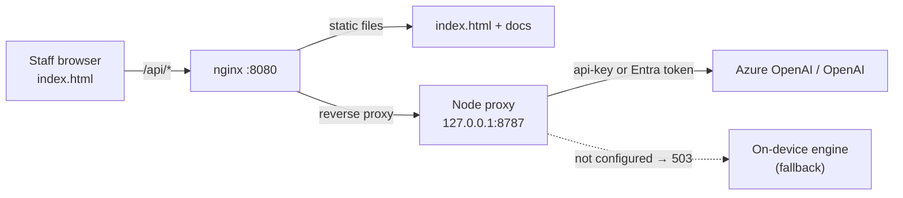

# Lotus Hotels · Guest Atelier

An AI-powered **Guest Personalization Assistant** for a boutique hotel chain — built as a hackathon proof-of-concept. It turns fragmented guest data (bookings, loyalty, past-stay notes, feedback) into instant, **explainable** recommendations that staff can act on at pre-arrival and check-in.

> **The gap it closes:** only **23%** of guests feel truly recognized, yet **78%** say personalization decides where they book. Guest Atelier is the bridge.

> **Live demo:** a hosted build runs on Azure Container Apps at
> `https://lotus-guest-atelier.proudrock-14272037.westus2.azurecontainerapps.io/`
> (staff sign-in `lotus` / `lotus`). See [Architecture](#architecture--two-ways-it-runs) and [Deployment](#cloud-deployment-azure-container-apps).


---

## Highlights

- **Single self-contained `index.html`** — no build step, no dependencies. Double-click and it runs, fully offline. (An optional container adds a backend for hosting — see [Architecture](#architecture--two-ways-it-runs).)
- **On-device by default** — the core reasoning engine runs entirely in the browser: no keys, no network, nothing leaves the machine. An **optional** server-side layer can add live LLM answers, with the **API key kept on the server** (or no key at all, via Entra managed identity).
- **Natural-language concierge** — staff ask in plain English; the engine resolves intent and returns tailored recommendations, with **contextual follow-up suggestions** after every answer.
- **Explainable by design** — every answer shows the **"Signals used"** (the exact profile cues behind it) plus a business **Impact** callout.
- **Dietary safety guardrails** — celiac/nut-allergy guests can *never* be shown an unsafe venue (hard filter + visible "Risk-Siren").
- **Real imagery** — guest portraits and photo thumbnails on every dining/activity recommendation (and photo-backed cards in the Local Flavor tool). Images load from the web with a graceful **fallback to inline SVG illustrations** if offline, so the demo never breaks.
- **"The Living Folio" art direction** — an editorial, ink‑and‑paper concierge identity: Fraunces ledger headings, a hand‑drawn hero, de‑boxed specimen rows, a signature **Lotus Dial** that inks in its petals as the personalization score rises, and a subtle paper grain. Deliberately not a generic SaaS dashboard.
- **Light & dark themes** — a warm rose-pink design system with a one-click theme toggle that respects your OS preference.
- **10 interactive "Atelier Tools"** — a launcher (press **T**) of visual, hands-on tools that turn guest data into action (storyboard, radar, dial, heatmap, constellation, and more).
- **One-click guided demo** — presenter-ready "Begin demo" mode with scene labels, pause/step/restart, and keyboard shortcuts.
- **Deployable** — an included Dockerfile + Azure Container Apps script host the app behind a staff sign-in, with an optional Azure OpenAI concierge and **keyless Entra ID (managed identity)** auth.

---

## What it does

| Capability | Description |
|---|---|
| **Guest dossiers** | 3 rich fictional profiles (anniversary couple, celiac business traveler, nut-allergy family) with tier, stay history, room prefs, dietary flags, interests, and source-tagged stay notes. |
| **Conversational queries** | "What are Sarah's room preferences?" · "Recommend gluten-free Italian for Marcus." · "Plan a family afternoon for the Okafors." |
| **Personalized recommendations** | Room & climate, dining, local activities, and special touches — ranked against the guest's profile and constraints. |
| **Proactive pre-arrival prep** | An owner-tagged checklist (Housekeeping / Kitchen / Concierge / Front Desk) generated per guest, with one-tap staff actions. |
| **Personalization score ("Bloom")** | A genuinely computed **AHP‑weighted** score (not a hardcoded number) — see [The personalization engine](#the-personalization-engine) — animated 23% → score to dramatize the transformation. Hover the Bloom to see the weighted criteria breakdown. |
| **Walk-in intake** | Capture an unknown guest's prefs at the desk and personalize on the spot — cold‑start tastes are predicted by **user‑based collaborative filtering** over a cohort of similar past guests. |
| **AI concierge (optional)** | When the app is deployed with an AI provider, answers can be generated by **Azure OpenAI / OpenAI** through a server-side proxy — the key stays on the server, and it falls back to the on-device engine if the backend is unavailable. |
| **Staff sign-in** | The hosted build gates access behind a full-screen staff login (`/api/login`); with no backend it accepts the published demo credentials so an offline copy still opens. |

### The five demo scenarios
1. What are Sarah's room preferences?
2. Recommend gluten-free Italian dining for Marcus.
3. Plan a family-friendly afternoon for the Okafors.
4. What welcome touch for Sarah's anniversary?
5. Anything to prep before Marcus checks in?


---

## The personalization engine

The Bloom score and walk-in tastes are **really computed on-device** — no hardcoded demo numbers, no API calls. The approach is adapted from Zhang et al., *"Hotel Recommendation Systems Based on AHP and Collaborative Filtering Combination Algorithm"* (2019 IEEE Chinese Control and Decision Conference, doc. 8832452), which pairs the **Analytic Hierarchy Process (AHP)** for weighting decision factors with **collaborative filtering** for cold‑start recommendation.

### Personalization score — AHP-weighted

Each guest is scored across six criteria: **loyalty, stay history, dietary clarity, stated preferences, occasion, and resolved stay-notes**. Rather than guess the weights, we build a 6×6 Saaty pairwise-comparison matrix (how much more each criterion matters than another), then derive the priority weights from its principal eigenvector:

1. Normalize each column of the matrix, then row‑average to get the weight vector `w` (≈ dietary 0.29, prefs 0.29, occasion 0.17, stays 0.11, notes 0.08, loyalty 0.07).
2. Compute λ<sub>max</sub>, the **Consistency Index** `CI = (λmax − n)/(n − 1)`, and the **Consistency Ratio** `CR = CI/RI`. Our matrix yields **CR ≈ 0.013 (< 0.10)**, so the judgments are internally consistent and the weights are valid.
3. Map each guest's data to a 0–1 sub-score per criterion, then `score = Σ(wᵢ · subᵢ) × 100` (clamped 5–99).

Hover the Lotus Dial to see the live per-criterion breakdown and the consistency ratio.

---

## Architecture — two ways it runs

Guest Atelier runs in two modes from the **same `index.html`**. Nothing about the guest experience changes between them; the difference is only *where* answers can come from and whether it's hosted.

### 1. On-device (default) — open the file, works offline
Double-click `index.html` (or serve it statically). Everything — intent parsing, recommendation ranking, dietary guardrails, the AHP score, and walk-in collaborative filtering — executes in vanilla JavaScript **in the browser**. No build, no dependencies, no network, no API keys, no data leaves the machine. **This is the mode used for the judged demo.**

### 2. Cloud (deployed) — nginx + a zero-dependency Node proxy
For a hosted, shareable version, a small container adds two things on top of the same static app:

- **Staff sign-in** — a full-screen login gate backed by `/api/login`.
- **Optional live AI concierge** — a `/api/chat` endpoint that proxies to **Azure OpenAI** (or OpenAI) so answers can be authored by a real LLM. **The API key never reaches the browser** — it lives only in the server process, injected as a container secret. Better still, the backend supports **keyless auth via Entra ID managed identity**, so in that configuration no key exists at all.

If the AI backend isn't configured (or is unreachable), `/api/chat` returns `503` and the frontend **gracefully falls back to the on-device engine** — so the app always answers.



**Backend endpoints** — `server.js`, a **zero-dependency** Node service (core `http` + `crypto` + `fetch`) that listens on `127.0.0.1:8787` and is reachable **only** through nginx's `/api/` location:

| Endpoint | Method | Purpose |
|---|---|---|
| `/api/health` | GET | Liveness + whether the AI provider is configured: `{ ok, configured, provider }`. |
| `/api/login` | POST | Validates staff credentials with a **timing-safe** comparison; returns `200` / `401`. |
| `/api/chat` | POST | Basic-auth-gated LLM proxy. Sends the guest dossier + staff question to the provider and returns the completion. The system prompt enforces **dietary restrictions as hard safety constraints** and forbids inventing facts. Guards: 1 MB body cap, 45 s timeout, 4 KB query / 8 KB context truncation. |

### Walk-in cold-start — user-based collaborative filtering

A walk-in has no rating history, so item‑based CF can't start. Following the paper's hybrid, we run **user‑based CF over guest attributes**: the new guest is represented as a vector of their occasion (one-hot) plus dietary flags, compared by **cosine similarity** against an anonymized cohort of past guests. We take the **k nearest neighbours** (top‑5, similarity > 0) and predict each taste's rating as a similarity‑weighted average, `pred(item) = Σ(simᵤ · ratingᵤ,item) / Σ simᵤ`. Tastes with a predicted rating ≥ 3.6 seed the guest's preferences (so downstream ranking recommends accordingly), and the average neighbour similarity becomes a **confidence** value shown in the walk-in panel ("Predicted from N similar guests · XX% match"). The score then blends AHP profile completeness with that CF confidence.

---

## Atelier Tools

Press **T** (or the grid icon in the header) to open the **Atelier Tools** launcher — ten interactive, visual tools that turn the guest data into something staff can *act on*. Each is built from the same in-memory profiles, fully on-device.


| Tool | What it does |
|---|---|
| **Stay Storyboard** | The whole guest journey on one animated timeline (pre-arrival → checkout) with an "experience completeness" meter — drag cards to reschedule, tick them off as done. |
| **Lobby Radar** | A calm live-arrivals board that places each guest in a lane by how urgently they need attention; hover a blip for their one thing. |
| **Magic Handoff** | Folds a full dossier into a clean shift-change briefing the next team can read in seconds — with one-tap copy. |
| **Delight Budget Dial** | Spin a radial dial to a budget/time tier and get guest-specific surprise ideas instantly. |
| **Risk Heatmap** | Allergy, dietary, timing and service risk across every active guest, as a color-graded grid. |
| **Room Match Constellation** | Pick a room and watch the guest's preferences light up the traits they connect to, with a live match score. |
| **Guest Mood Mixer** | Set the mood with sliders and watch the greeting and recommended next actions adapt in real time. |
| **Recovery Playbook** | Drop an incident on a guest to generate a tailored acknowledge → fix → delight → log plan. |
| **Local Flavor Composer** | Composes a bento-style itinerary from interests, time available, and today's conditions — with a "surprise me" reshuffle. |
| **Service Load Balancer** | Balances prep tasks across the team on a kanban board — drag to reassign and watch the workload rings update live. |


---

## Running it

**Simplest:** double-click `index.html` — it opens in your browser and works offline.

**Recommended for a live demo (serve over localhost):**
```bash
# from the project folder
python -m http.server 8777
# then open http://localhost:8777/index.html
```

### Presenter controls (Guided Demo)
Click **▶ Begin demo** (or press **P**) to auto-run the scripted scenarios.

| Key | Action |
|---|---|
| `1`–`5` | Jump to a scenario |
| `P` | Start / stop the guided demo |
| `W` | Walk-in intake |
| `T` | Open the Atelier Tools launcher |
| `Space` | Pause / resume the demo |
| `→` | Skip to the next scene |
| `R` | Restart the demo |
| `Esc` | Stop the demo |

### Light & dark themes
Click the sun/moon toggle in the header (top-right) to switch themes. Your choice is remembered, and on first visit the app follows your operating-system light/dark preference. The palette is the warm **ATV design system** — terracotta accent, clay/cream neutrals, Fraunces + DM Sans type.


### Staff sign-in
The app opens on a full-screen **staff login**. When a backend is present it validates against `/api/login`; with **no backend** (a plain static copy) it accepts the published demo credentials **`lotus` / `lotus`** so an offline copy still opens. Sign-out is available from the header.

### Cloud deployment (Azure Container Apps)
The included `Dockerfile` builds a single `nginx:1.27-alpine` image that **serves the static app** and **reverse-proxies `/api/`** to the bundled zero-dependency Node concierge (`server.js`). Two entrypoint hooks run at startup: one seeds an `htpasswd` file from the auth env vars, the other launches the Node proxy.

Deploy with Azure CLI from the project folder:

```powershell
.\scripts\deploy-azure-container-app.ps1 -Subscription "<subscription name or id>"
```

The script registers the required providers, then creates a project-scoped **resource group**, **Azure Container Registry**, **Container Apps environment**, and **Container App** (external ingress on port `8080`), and finally prints the app URL plus the generated credentials.

**Configuration (environment variables / container secrets):**

*Staff auth*
| Variable | Description |
|---|---|
| `STAFF_USER` / `STAFF_PASS` | Staff login credentials. Fall back to `BASIC_AUTH_USER` / `BASIC_AUTH_PASSWORD`, then to `lotus` / `lotus`. |
| `BASIC_AUTH_USER` | Legacy nginx/htpasswd user. Defaults to `guest`. |
| `BASIC_AUTH_PASSWORD` | Required by the container entrypoint; store as an Azure Container Apps secret. |

*AI provider (all optional — omit everything to run on-device only)*
| Variable | Description |
|---|---|
| `AI_PROVIDER` | `azure` (default) or `openai`. |
| `AI_ENDPOINT` | Azure OpenAI resource endpoint (e.g. `https://<res>.openai.azure.com`). |
| `AI_DEPLOYMENT` | Azure deployment name. |
| `AI_API_VERSION` | Azure API version (default `2024-08-01-preview`). |
| `AI_API_KEY` | Provider key. **If omitted on Azure, the backend uses keyless Entra ID managed identity.** |
| `AI_AUTH_MODE` | `key` or `entra` (auto-detected from `AI_API_KEY`). |
| `AI_MODEL` | Model name for the `openai` provider (default `gpt-4o-mini`). |
| `AI_MAX_TOKENS` · `AI_TEMPERATURE` · `AI_SYSTEM_PROMPT` | Generation tuning + the concierge system prompt. |

> **Note — deploying does not happen on `git push`.** There is no CI/CD in this repo; the container image is built from source by the deploy script (`az acr build`). After pushing new code to GitHub, **re-run the deploy script** (or `az acr build` + `az containerapp update --image …`) to roll the running app forward. Until then, the live URL keeps serving the previously built image.

---

## How it was built — the agent network

This app wasn't written in one pass. It was produced by a **multi-agent "build network"** — an orchestrated crew of specialized AI agents, each with one job, coordinated by a Director that reconciles their output and iterates until it passes a real QA gate.

| Agent | Role | What it contributed here |
|---|---|---|
| **Director** | Orchestration & oversight | Ran the pipeline, arbitrated conflicts, kept scope tied to the brief |
| **Architect** | Prompt/spec engineer | Turned the brief into checkable acceptance criteria |
| **Maker** | Builder | Wrote the actual HTML/CSS/JS |
| **Critic** | Anti-"AI-slop" | Drove the original editorial direction, custom lotus, provenance lines, and invented venue names |
| **Wildcard** | Creative | Hero "23% → personalized" reveal, Bloom score, allergy Risk-Siren |
| **Verifier** | QA (owns the gate) | **Executed the app in a headless browser**; caught real bugs and a demo race condition |
| **User Advocate** | Real-need check | Owner-tagged checklist, quick actions, impact callouts, projector-safe layout |
| **Guardian** | Security · privacy · a11y | Caught a **DOM-XSS**, hardened data handling, and drove WCAG-AA contrast + keyboard/ARIA accessibility across both themes |

### How the network shaped it (across iterations)
- **DOM-XSS** — free-text queries were injected via `innerHTML`; now escaped.
- **Demo race condition** — stop-then-restart could overlap runs; fixed with a per-run token.
- **Key handling** — the in-browser API-key field was removed so the default app is 100% on-device; when a live LLM is wanted, the key is kept **server-side only** (or eliminated via Entra managed identity), never exposed to the browser.
- **Intent-routing bugs** — a stopword ("the") mis-routed guests; welcome-touch vs. prep priority; missing family/afternoon intents. All fixed and re-verified.
- **Accessibility** — clickable `div`s became real buttons/checkboxes; ARIA labels, dialog semantics, `prefers-reduced-motion`, and AA contrast checked in light **and** dark.
- **UI polish** — informed by public design references (Impeccable, the "11 ways to improve vibe-coded design" deck, ui-ux-pro-max, CopilotKit): one accent colour with room to breathe, real SVG icons (no emoji), and de-cluttered surfaces.


---

## Project history — everything that's been done

A condensed changelog of how Guest Atelier got here, in the order it happened:

1. **Multi-agent "build network."** Created a reusable 9-role pipeline (Director, Researcher, Architect, Maker, Critic, Wildcard, Verifier, User Advocate, Guardian) with an iterate-to-green loop and a Verifier-owned QA gate. Every feature below was built and reviewed through it.
2. **Initial build.** Self-contained `index.html`: 3 guest dossiers, a natural-language intent engine, ranked recommendations, source-tagged "signals used" explainability, business-impact callouts, and hard **dietary safety guardrails**.
3. **Bug fixes from the first network review.** Intent-routing errors (a stopword mis-route, welcome-touch vs. prep priority, missing family intents), a **DOM-XSS** via `innerHTML`, and a guided-demo race condition — all caught and fixed.
4. **Bells & whistles.** One-click **guided demo** (scene banner, pause/step/restart), keyboard shortcuts, entrance animations, and accessibility passes (ARIA, `prefers-reduced-motion`, AA contrast).
5. **GitHub repo.** Published as a **private** repo (`vvundela1111/lotus-guest-atelier`) with README, MIT license, and `.gitignore`.
6. **Frontend redesign + dark mode.** Reworked the UI from public design references (CopilotKit, Impeccable, ui-ux-pro-max, an Azure static reference); added token-based **light/dark themes**; removed the in-browser API-key UI.
7. **ATV design system + rose-pink accent.** Adopted the warm editorial token palette (Fraunces + DM Sans), then switched the accent from terracotta to **rose-pink** across both themes.
8. **10 interactive "Atelier Tools."** A press-**T** launcher of visual, hands-on tools (storyboard, radar, dial, heatmap, constellation, and more).
9. **"The Living Folio" anti-AI-slop redesign.** Editorial identity: ledger headings, a hand-drawn hero, de-boxed specimen rows, the signature **Lotus Dial**, and a paper grain.
10. **Real imagery.** Web-loaded guest portraits + **unique** venue/food photos, each with a graceful inline-SVG fallback so the demo never breaks offline.
11. **Genuine AHP personalization score.** Replaced hardcoded demo numbers with a real **Analytic Hierarchy Process** computation (Saaty matrix → eigenvector weights → consistency ratio). See [The personalization engine](#the-personalization-engine).
12. **Collaborative filtering for walk-ins.** Cold-start, user-based CF over guest attributes (cosine similarity → kNN taste prediction + confidence), adapted from the cited IEEE paper.
13. **Cloud track.** Added a deployable container: **nginx + a zero-dependency Node proxy**, a **staff login**, an optional **Azure OpenAI** concierge, **keyless Entra ID (managed identity)** auth, and a one-command **Azure Container Apps** deploy script.
14. **Login lockout fix.** Hardened the staff-login fallback so a static/offline copy still opens with the demo credentials (a `404` from a keyless static host no longer blocks sign-in).

> **Current deployment status:** the code above is fully pushed to GitHub. The hosted container is live but is rebuilt manually — after a push, re-run the deploy script to roll the running app forward (see the note under [Cloud deployment](#cloud-deployment-azure-container-apps)).

---

## Tech & scope

- **Stack:** vanilla HTML + CSS + JavaScript for the frontend — zero frameworks, zero build, one file. **Optional backend:** a **zero-dependency** Node service (core `http`/`crypto`/`fetch`) behind nginx, packaged as a container for Azure Container Apps.
- **UX system:** adapted from [ATV Design](https://github.com/All-The-Vibes/ATV-Design) using its warm editorial tokens, Fraunces/DM Sans typography, compact controls, layered surfaces, and responsive layout patterns.
- **Data:** in-memory fictional profiles (no database, no persistence, no PII).
- **AI:** an on-device rule/intent engine by default — no keys, no network. **Optionally**, a server-side proxy to **Azure OpenAI / OpenAI** with the key kept on the server (or **keyless via Entra managed identity**), with automatic fallback to the on-device engine.
- **Design:** "The Living Folio" — an editorial ink‑and‑paper identity (Fraunces + DM Sans, rose‑pink accent, ledger headings, Lotus Dial, paper grain), light + dark themes, run through anti‑AI‑slop principles (one accent, tone‑step regions over boxes, sentence case over shouty caps, real SVG not emoji).
- **In scope now:** on-device personalization, explainability, dietary guardrails, the AHP score + walk-in CF, and an optional hosted build with staff login + AI proxy.
- **Out of scope (per the hackathon brief):** real PMS/booking integration, production identity/RBAC (a demo staff login exists, but not full role-based access), and a native mobile app.

### Success metrics it targets
Higher guest satisfaction · more direct bookings & repeat visits · reduced front-desk inquiry volume · staff empowered with instant, trustworthy insights.

---

## Project structure
```
.
├── index.html                        # the entire frontend (on-device engine + UI + login)
├── server.js                         # optional zero-dependency AI concierge + login proxy
├── Dockerfile                        # nginx + Node image (serves app, reverse-proxies /api/)
├── nginx.conf                        # static serving + /api/ proxy + /healthz
├── docker-entrypoint-basic-auth.sh   # seeds htpasswd from auth env vars
├── docker-entrypoint-backend.sh      # launches the Node proxy at container start
├── .dockerignore
├── scripts/
│   └── deploy-azure-container-app.ps1 # one-command Azure Container Apps deploy
├── README.md
├── LICENSE
└── docs/                              # screenshots for this README
    ├── screenshot-hero.png            # light theme
    ├── screenshot-dark.png            # dark theme
    ├── screenshot-guardrail.png       # dietary guardrail
    ├── screenshot-tools.png           # Atelier Tools launcher
    └── screenshot-constellation.png   # Room Match Constellation
```

---

*Built as a hackathon proof-of-concept. Guest data is entirely fictional.*
